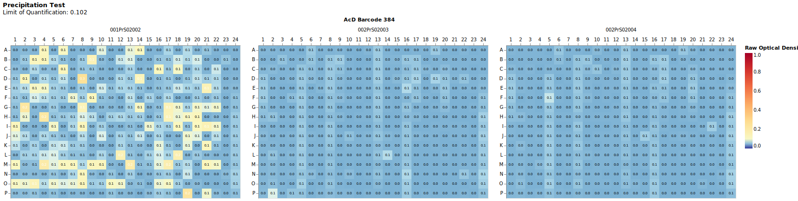

# Precipitation Test

Quality control method to check for [precipitation](https://en.wikipedia.org/wiki/Precipitation_(chemistry)) of substances.<br>
A precipitating substance can be incorrectly recognized as active.
This assay helps us to mark this false positive result.

Precipitation testing is usually done additionally on an experiment such as MIC or primary screen.
Therefore, the following examples are for the evaluation of a MIC assay with precipitation measurement.

The threshold for a substance to be precipitated is the **limit of quantification**(LoQ) [[1]](https://de.wikipedia.org/wiki/Bestimmungsgrenze),[[2]](https://pubmed.ncbi.nlm.nih.gov/8013092/):

> LoQ = mean(background) + 10 * standarddeviation(background)

There is an option to exclude outliers from the precipitation background samples.
For now, outliers are detected by checking for values 2 times above the median of the background samples.
```Python
mic = rda.MIC(
    "../data/raw/",
    "../data/input/MIC_Input.xlsx",
    "../data/input/DiS_MP_AsT_2024-12-02.txt",
    "../data/input/AmA_AsT_AcD_20241204.txt",
    precipitation_rawfilepath = "../data/raw/Präzipitationsmessung/",
    precip_exclude_outlier=True,
)
```

## Specifying background samples:

Using a list of positions (all plates):
- Useful for specifying other background rows or columns for all plates
- Shown example is the default, column 24 of each 384 plate is defined as background samples
```Python
mic = rda.MIC(
    ...
    precipitation_rawfilepath = "../data/raw/Präzipitationsmessung/",
    background_locations=[f"{row}24" for row in string.ascii_uppercase[:16]]
)
```

Using a dictionary of positions with barcodes (plate specific):
- Useful for specifying very specific background samples per plates
```Python
mic = rda.MIC(
    ...
    precipitation_rawfilepath = "../data/raw/Präzipitationsmessung/",
    background_locations={}
)
```


# Precipitation Results
The precipitation results are visible in the end-results tables as well as in the `.../figures/QualityControl` folder.



A heatmap of each precipitation test plate is written.
On the top left corner the calculated "Limit of Quantification" ("Nachweisgrenze") is shown.

## Limit of Quantification
> The limit of quantification (LoQ, or LOQ) is the lowest value of a signal (or concentration, activity, response...) that can be quantified with acceptable precision and accuracy [[1](https://en.wikipedia.org/wiki/Detection_limit)].

Some substances may precipitate at certain concentrations.
This may interfere with our method of detecting activity.

We calculate the LoQ like this:

$$
LoQ = y_B + (10 * s_B)
$$
- $y_B$: Mean of the background
- $s_B$: Standarddeviation of the background


